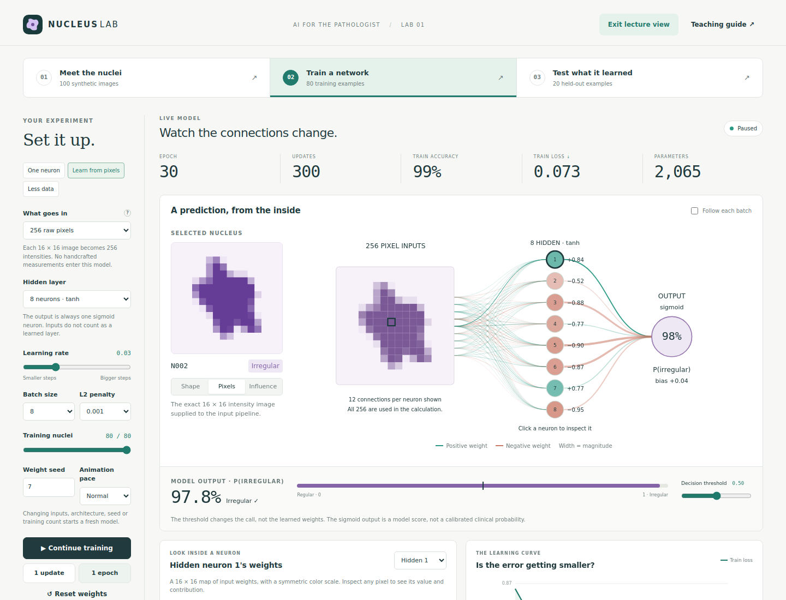

# Nucleus Lab

An interactive **AI for the pathologist** teaching lab. Residents train a real, small neural network to distinguish **regular vs irregular synthetic nuclear contours**, watch its weights change, and evaluate a fixed held-out set.



## Open it

Download or clone the repository and open **`index.html`** in a modern browser. It also works completely offline from a `file://` URL: no installation, build step, server, API key, external fonts or runtime dependencies.

For a local web server, run `npm start` and open `http://localhost:4173`. Alternatively, upload the repository files unchanged to any static web host. All paths are relative, so hosting in a subdirectory works.

For GitHub Pages, choose **Settings → Pages → Deploy from a branch → main → / (root)** after the app is on main. Hosting is not enabled by this code change.

## In the lab

- **Meet the nuclei:** a committed bank of 100 simple, purple nucleus drawings, each paired with its exact 16 × 16 raster. There are 80 training images (40/40) and 20 test images (10/10).
- **One neuron:** four explicit shape measurements → a sigmoid output. This is logistic regression, with one learned affine layer. The measurements are engineered, not learned.
- **Learn from pixels:** 256 intensity inputs → eight tanh hidden neurons → one sigmoid output. Choose no hidden layer or 4, 8 or 12 hidden neurons in either input mode.
- **Adjust the experiment:** learning rate, batch size, L2 regularization, training count, random initialization seed, playback speed and decision threshold.
- **Watch real learning:** continuous playback, one batch update or one epoch; actual activations, signed weights, first-layer weight maps, bias, arithmetic, loss and training accuracy. Click nodes or use the neuron selector. The last-update panel shows a real gradient and parameter change.
- **Inspect images:** source contour, exact pixels, or patch-removal influence. The thumbnail bank displays live probabilities and correctness; filter to mistakes.
- **Test separately:** the 20 test cases never enter training or scaler fitting. Evaluate with frozen weights, view sensitivity, specificity and confusion counts, and inspect individual test examples using the same visualizations.
- **Probe a shortcut:** shift or change the stain of an individual image. These temporary changes never enter reported metrics or modify the dataset.
- **Teaching guide:** an embedded 10–15 minute demonstration plan, definitions, limits and links to primary educational sources. A longer presenter guide is in `docs/teaching-guide.md`.
- **Lecture view:** hide the introductory banner and enlarge the live network for projection.
- **Export:** download weights, scaler, settings, training history and predictions as JSON. Current settings are recorded; an edit history of mid-run hyperparameter changes is not recorded. Export is not a checkpoint importer.

## Dataset and honest interpretation

These are **schematic synthetic contours, not microscopy or clinical data**. “Irregular” does not mean malignant. Chromatin, nucleoli, tissue context, artifacts and patient outcomes are not modeled.

The shape generator varies nuclear radius, elongation, position, rotation and stain. These nuisance variables are paired across labels. Each pair is entirely in one split. Smooth contours receive label 0; lobulated contours receive label 1. The contour's label and generator parameters never enter the model; measurements are recomputed from raster pixels. Nuisance matching does not prove that a pixel model cannot find other synthetic shortcuts.

Both input modes center and scale their inputs using **only the active training subset**. Shape measurements come from a binary mask at intensity ≥ 0.28. The four features are square-grid edge complexity, concavity, moment-based elongation and occupied area. Grid perimeter is not a calibrated morphometry measurement; even a smooth rasterized circle has complexity above 1.

The Influence view removes a 2 × 2 input patch, reruns the complete input pipeline and subtracts the perturbed probability from the original. Positive/teal means the removed patch supported an irregular prediction; negative/coral means the opposite. Maps use a per-image symmetric scale with a 0.03 floor; inspect numerical effects rather than comparing color saturation across images. Masking can create artificial holes. This is a perturbation test, **not an attention map, a causal explanation, or a biological ground truth**.

All calculations use vanilla JavaScript, including minibatch SGD, analytic backpropagation, tanh, sigmoid and numerically stable binary cross-entropy. Weights use a seeded uniform initialization. L2 applies only to weights; displayed loss excludes the regularization penalty. Every network edge represents an actual learned weight. In pixel mode a labeled subset of 12 connections per destination neuron is drawn for readability; all 256 are used and all are available in the weight map. Hidden node color indicates activation sign and magnitude; edge color indicates weight sign, not correctness.

Twenty test cases are intentionally small: each changes accuracy by 5 percentage points. Repeated test-driven tuning makes that set development data. A real comparison requires independent validation for model selection and a new untouched final test set, typically split at the patient level. The displayed sigmoid score is not clinically calibrated.

## Files

| Path | Purpose |
| --- | --- |
| `index.html`, `style.css` | Responsive, keyboard-accessible lesson UI |
| `src/core.js` | Pure numerical model, preprocessing, morphology and influence calculations |
| `src/app.js` | Browser controls, training loop and live visualizations |
| `data/nuclei.js` | Fixed raster data and source contour coordinates; no runtime generation |
| `data/manifest.csv` | Labels, image paths, paired grouping and fixed splits |
| `nuclei/N001.svg` … `N100.svg` | All 100 pre-created source drawings |
| `scripts/generate-data.cjs` | Seeded, reproducible dataset generator |
| `tests/core.test.cjs` | Numerical gradient, data integrity, training and isolation checks |

## Verify or regenerate

Requires a recent Node.js for the developer scripts (Node 18 or newer; verified with Node 24).

```sh
npm test
npm run generate
```

Tests verify finite-difference gradients for the linear and hidden-layer models, deterministic training, loss reduction, split integrity, scaler isolation, test-data rejection by the training engine, exact occlusion deltas and frozen weights during evaluation. The generated dataset is committed; regeneration is unnecessary to use the site.

## Sources

- [Stanford CS231n: a simple neural network case study](https://cs231n.github.io/neural-networks-case-study/) — learned weights, loss, gradient descent and a hidden layer.
- [Stanford CS231n: linear classification](https://cs231n.github.io/linear-classify/) — image weights and templates.
- [Zeiler & Fergus, Visualizing and Understanding Convolutional Networks](https://arxiv.org/abs/1311.2901) — a primary source for occlusion experiments. This app uses a small fully connected network, not that paper's CNN.

Educational use only. No patient data is needed or sent anywhere; the application has no analytics or external services.
